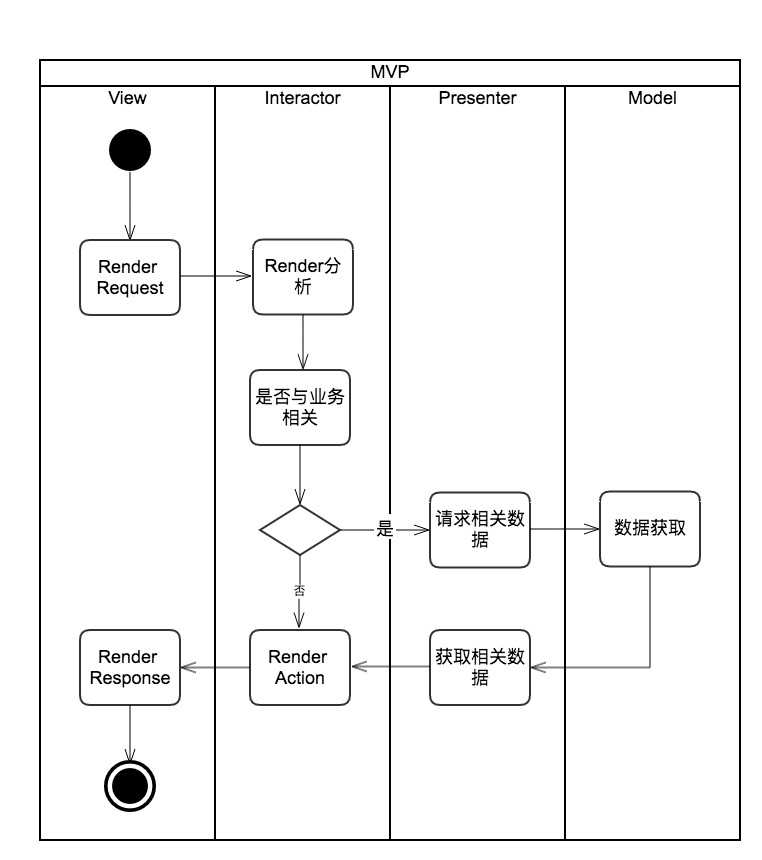

# MVIP
1. MVIP architecture is come from MVP Pattern

2. The detail information：[MVIP详解](https://panzhow.gitbooks.io/ios/content/%E6%9E%B6%E6%9E%84%E8%AE%BE%E8%AE%A1/%E6%9E%B6%E6%9E%84/MVIP%E6%A8%A1%E5%BC%8F.html) 

3. 实现图解：

	
	
4. 类图结构：

	
